## Understanding the Problem

The first thing I did was to analyze and understand the actual problem behind the challenge: intent qualification.

The input consists of a company database and a user query. The goal is to return the companies that best match the user's intent. From the beginning, I saw the problem as having two important parts.

The first part is understanding the received company data and preparing it in such a way that, during search time, I can work with objects that are easy to query. The second part is building the actual search pipeline. These two parts are connected, because both the preprocessing step and the runtime pipeline depend on the algorithms and techniques I choose to use.

At this initial stage, I did not want to start by preprocessing the data immediately. The challenge description already gives enough information about what the company records are expected to contain, although this still has to be verified against the actual dataset. Based on this expected structure, I can first reason about what kind of search pipeline would make sense.

## Thinking About the Proposed Baselines

The first thing worth analyzing is the set of baselines proposed in the challenge itself, and why they do not fully satisfy the constraints of the problem.

After reading them, my impression was that the two proposed baselines are almost opposite extremes.

The first baseline, using an LLM for each company, should have strong semantic accuracy, because the model can directly reason about whether a company matches the user query. However, the cost and execution time would be very high, especially if the database is large or if the system receives many queries.

The second baseline, based on embedding similarity, is much faster and more standard from an information retrieval perspective. However, it is not enough by itself, because it does not truly understand the user's intent. It can retrieve companies that are semantically close to the query, but not necessarily companies that satisfy the actual business requirement.

This is why the challenge pushes toward a more complex solution that combines multiple techniques instead of relying entirely on one of these two baselines.

## Should I use an LLM?

At this point, several questions came to mind. If I decide to use an LLM, am I expected to use an API-based model such as OpenAI or Gemini? Or should I search for and choose a model proposed in the literature? My conclusion was that the exact source of the LLM is not the most important part of the solution. What matters more is where and how the LLM is used in the system.

Depending on the role I assign to the LLM, I can decide how powerful that model needs to be. Some research-oriented solutions would involve downloading and running local models, or even fine-tuning a model on custom data. However, for a practical first version of this challenge, I did not want the solution to depend on training neural networks locally or configuring a separate model server that `solution.py` would need to call at runtime.

This challenge seems more focused on the design of a robust search and qualification pipeline than on training a custom neural model from scratch.

For that reason, I decided that an API-based LLM is a reasonable choice for the first version. It removes the engineering overhead of model hosting and fine-tuning, and allows me to focus on the architecture of the retrieval and qualification system.

For the implementation, I chose Gemini 2.5 Flash. The main reason was that it is easy to integrate, fast enough for query-time usage, and suitable for structured query understanding. Cost also matters, but the more important point is that the model is used as a practical component inside the pipeline, not as the entire solution.

## If I Use an LLM, What Exactly Should I Use It For?

The next question I asked myself was whether I actually need an LLM.

My intuition was that I probably do. Classical information retrieval algorithms are useful, but I do not think they are enough on their own for matching a user's business intent to the correct companies. The challenge is not only to retrieve textually similar profiles, but to understand what kind of company the user is actually looking for.

If I use an LLM, then the important design question becomes: where should I place it in the pipeline?

I considered several options.

- The first option was to use the LLM offline, during data preprocessing. For example, I could process every company profile with the LLM and extract additional structured information from the database fields. This extracted information could then be used later by classical search algorithms.

I decided not to do this. The main problem is that I do not know in advance what future users will search for. If I force the company data into a fixed LLM-generated representation too early, I may remove or compress information that later turns out to be useful. For this reason, I chose not to preprocess the company database with the LLM.

- The second option was to use a smaller version of the first baseline. Instead of sending every company in the database to the LLM, I could first use classical retrieval methods to obtain a smaller candidate set, and then apply the LLM only to those candidates.

This is more reasonable than applying the LLM to the entire database, but I still considered it too heavy for a first version. It would still add cost and latency to every query. More importantly, this design depends heavily on the first retrieval stage: if the classical retrieval step does not understand the user's intent well enough, the LLM would only rerank or classify a weak candidate set. In that case, the final model would be powerful, but it would still be limited by what the earlier retrieval step managed to find.

Because of this, I decided not to use the LLM as a per-candidate judge in the first implementation.

- The third option was to use the LLM only once, directly on the user query.

This seemed like the most promising option. The original difficulty of the problem is the user's intent, so it makes sense to apply the LLM at the point where that intent is expressed most directly: the query itself.

The role of the LLM is therefore to decode and standardize the query before any retrieval happens. This can help in several ways. It can turn an unstructured natural-language query into a more structured search representation. It can normalize the user's wording, handle spelling mistakes, and infer useful synonyms or related business terms. After that, cheaper and more deterministic retrieval and filtering algorithms can be applied more effectively.

I chose this third approach: use the LLM once per query, as a query understanding component, not as a company-by-company classifier.

## Overall Pipeline Design

After deciding where and how to use the LLM, the next question was how to build the rest of the pipeline.

The important point is that the output of the LLM should not be designed in isolation. It should depend on the algorithms that come after it. If the next stages need lexical terms, semantic descriptions, filters, or exclusion criteria, then the LLM should extract and organize exactly those kinds of information from the user query.

With that in mind, the first step of the pipeline is query parsing. The LLM reads the user query and extracts information that can be useful for the following stages.

The second step is the actual search stage: retrieving an initial set of candidate companies. I wanted this step to be handled by cheaper and more scalable retrieval algorithms, not by the LLM. At this point, there are two useful families of retrieval methods. The first family is lexical search, which tries to match explicit terms. The second family is semantic search, which tries to retrieve companies based on meaning rather than exact wording.

Since the LLM can produce information useful for both types of retrieval, it makes sense to use both approaches in parallel and then combine their results. Lexical retrieval can capture exact business terms, industries, locations, or offerings. Semantic retrieval can capture broader meaning and related phrasing. Combining them should give better candidate recall than relying on only one of them.

The third step should reduce the candidate set. After retrieval, I expect the system to still contain many false positives. Some of them may be semantically related to the query, but they may violate explicit constraints. These can be removed by checking hard conditions such as geography, public/private status, founding year, revenue, or employee count, when such constraints are present in the query.

The fourth step is to rank the remaining companies. At this point, instead of asking an LLM to judge each company, I can compute explicit decision scores based on how well each company matches the different parts of the parsed query.

There could also be a fifth step, where an LLM reranks the final candidates. However, I decided not to include this in the first version. The main reason is that it would change the cost profile of the system. The current design uses one LLM call per user query. If I add an LLM-based reranking step, the number of LLM calls grows with the number of candidates, which increases cost and latency by at least an order of magnitude.

So the pipeline I chose is:

1. parse the user query with an LLM;
2. retrieve candidates using lexical and semantic search;
3. remove candidates that fail hard constraints;
4. rank the remaining candidates using explicit scoring features.

This keeps the LLM usage limited and predictable, while still using it at the point where it is most useful: understanding the user's query.

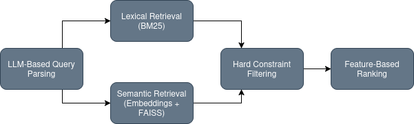

## Step 1: What Should the LLM Extract From the Query?

Once I decided to use the LLM only once, at the beginning of the pipeline, the next question was what exactly I should ask it to produce.

I did not want the LLM to return a final answer or a list of companies. That would move too much responsibility into a component that is expensive, less deterministic, and harder to debug. Instead, I wanted the LLM to transform the natural-language query into a structured object that the rest of the system can use.

I called this object a `QueryPlan`.

The idea behind the `QueryPlan` is simple: the query usually contains different types of information, and each type is useful for a different part of the pipeline.

Some information is useful for retrieval. For example, if the user asks for “renewable energy equipment manufacturers in Europe”, then words like “renewable energy”, “equipment”, and “manufacturers” are useful search terms. These terms can help both lexical and semantic retrieval.

Some information is useful for filtering. For example, if the user explicitly asks for companies in Germany, or public companies, or companies with more than 1,000 employees, these are not soft preferences. They are hard constraints. A company that violates them should usually be removed, even if its description is semantically similar to the query.

Some information is useful for ranking. For example, the query may imply an industry, a business model, a type of offering, and a target market. A company matching all of these aspects should rank higher than a company matching only one of them.

For this reason, the `QueryPlan` contains several groups of fields.

First, it contains hard filters:

- country codes;
- minimum and maximum founding year;
- minimum and maximum revenue;
- minimum and maximum employee count;
- public/private status.

These fields are used later in the hard filtering step.

Second, it contains terms that are useful for retrieval and scoring:

- countries;
- regions;
- industry terms;
- NAICS-related terms;
- business model terms;
- offering terms;
- target market terms;
- canonical terms;
- exclusion terms.

These fields allow the system to search and score companies using more specific signals than the original raw query.

Third, it contains a short `target_description`. This is a compact semantic description of the kind of company the user is looking for. I use this field for semantic retrieval, because embedding a clean description of the target company is usually better than embedding a messy natural-language query directly.

One important rule I gave the LLM was not to invent constraints. If the user does not mention a revenue range, employee count, public status, or founding year, those filters should stay empty. I wanted the LLM to clarify and structure the query, not to make unsupported assumptions.

This is especially important for geography. If the user mentions a country, the LLM can convert it into an ISO country code. If the user mentions a region such as Europe, the LLM can expand it into a list of country codes. But if the location is ambiguous, the system should preserve that ambiguity instead of inventing a precise filter.

So the first step of the pipeline is not just “LLM parsing”. It is a controlled transformation from a vague natural-language query into a structured search plan that tells the rest of the system what to retrieve, what to filter, and what to rank.

## Step 2: How Should I Retrieve the Initial Candidates?

After query parsing, the next problem is candidate retrieval.

At this stage, I do not want to decide the final answer yet. I only want to build a candidate set that is likely to contain good matches. This means retrieval should have good recall: it is better to retrieve some extra false positives than to miss companies that could be correct answers.

I decided to use two retrieval methods in parallel: lexical retrieval and semantic retrieval.

For lexical retrieval, I used BM25. This is a classical information retrieval algorithm that works well when the query contains important explicit terms. In this problem, those terms can be industry names, NAICS labels, business model words, product or service names, countries, regions, or target markets.

The advantage of BM25 is that it rewards exact term matches. If a company profile explicitly contains terms such as “solar panels”, “B2B”, “packaging”, “medical devices”, or “logistics”, BM25 can capture that signal directly.

For semantic retrieval, I embed the `target_description` produced by the LLM and search against embeddings of the company profiles. This allows the system to retrieve companies that are close in meaning, even when the wording is different.

The two result sets are then combined. Each method returns candidates with its own score, so I normalize the BM25 scores and semantic scores separately using min-max normalization. Then I compute a combined retrieval score:

`retrieval_score = 0.5 * bm25_score_norm + 0.5 * semantic_score_norm`

I chose equal weights here because, at the retrieval stage, I do not want to assume that one signal is always more important than the other. Lexical and semantic retrieval are complementary. The goal is to build a balanced candidate set, not to make the final decision.

The output of this step is a table of candidate companies with a retrieval score, together with the company fields needed by the next stages.

## Step 3: How Should I Apply Hard Constraints?

After retrieval, I expect the candidate set to contain false positives. The next question is how to handle constraints that should not be treated as soft ranking signals.

For example, if the user asks for companies in France, a company outside France should not rank highly just because its description is semantically similar. If the user asks for public companies, a private company should not be kept only because it matches the industry. If the user specifies a minimum employee count or revenue, companies missing or failing those constraints should be removed.

This is why I added a hard filtering step after retrieval.

The filters come from the `hard_filters` section of the `QueryPlan`. In the implementation, I check:

- country codes;
- public/private status;
- founding year range;
- revenue range;
- employee count range.

I decided to apply these filters after retrieval, not before retrieval. The reason is that retrieval works on the prepared searchable text and is meant to gather candidates based on business relevance. Hard filters are then used to enforce explicit constraints on the retrieved candidates.

This also keeps the system easier to debug. Before removing candidates, I first mark whether each candidate passed the hard filters and store the reasons for failure. For example, a candidate may fail because the country code is missing, because it is outside the allowed countries, or because the employee count is out of range.

For the first version, I chose a strict interpretation of hard filters: if the query explicitly requires a value and the company is missing that value, the company does not pass the filter. This may remove some potentially relevant companies with incomplete data, but it avoids returning companies that cannot be verified against the user's stated constraints.

## Step 4: How Should I Rank the Remaining Companies?

After hard filtering, the remaining companies satisfy the explicit constraints, but they are not necessarily equally good matches. I still need a final ranking step.

The idea is to compute several simple and interpretable scores that measure how well each company matches different parts of the parsed query.

I compute the following partial scores:

- `industry_score`;
- `business_model_score`;
- `offering_score`;
- `target_market_score`;
- `exclude_penalty`.

The `industry_score` checks whether the company matches the industry, NAICS, and canonical terms extracted from the query. I compare these terms mostly against the NAICS fields and the company description. I give more weight to NAICS than to the description, because NAICS is a more structured industry signal.

The `business_model_score` checks whether the company matches the business model terms from the query. These are compared mainly against the company’s business model field, but also against the description.

The `offering_score` checks whether the company offers the products or services implied by the query. These terms are compared mainly against the company’s core offerings, with the description used as a secondary signal.

The `target_market_score` checks whether the company serves the kind of customers or industries implied by the query. These terms are compared mainly against the target markets field, again with the description as a secondary signal.

The `exclude_penalty` is used when the query clearly implies exclusions. If an excluded term appears in the company text, the final score is reduced.

The final score combines these signals as follows:

`final_score = 0.40 * retrieval_score + 0.20 * industry_score + 0.15 * business_model_score + 0.15 * offering_score + 0.10 * target_market_score - 0.20 * exclude_penalty`

I chose these weights manually for the first version.

The retrieval score receives the largest weight because it already combines two broad retrieval signals: lexical and semantic relevance. It acts as the general relevance backbone of the ranking.

The industry score receives the next largest weight because industry fit is usually one of the most important aspects of company search. If the company is in the wrong industry, it is unlikely to be a good match even if some words overlap.

The business model and offering scores receive meaningful but slightly smaller weights. They are important because many business queries are not just about industry, but about what the company actually does and how it operates.

The target market score receives a smaller weight because target market information can be useful, but it is often less consistently available or less explicitly stated in the data.

The exclusion penalty is subtracted because exclusion terms should push companies down when they match something the user does not want.

This scoring layer is intentionally simple. It is not meant to be a perfect learned ranker. Its purpose is to provide a cheap, explainable reranking step that improves over raw retrieval while keeping the system scalable and easy to inspect.

## Data Preparation

Before building the retrieval pipeline, I inspected the company database to understand its real structure. I checked duplicates, missing values, column types, and nested fields.

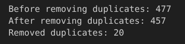

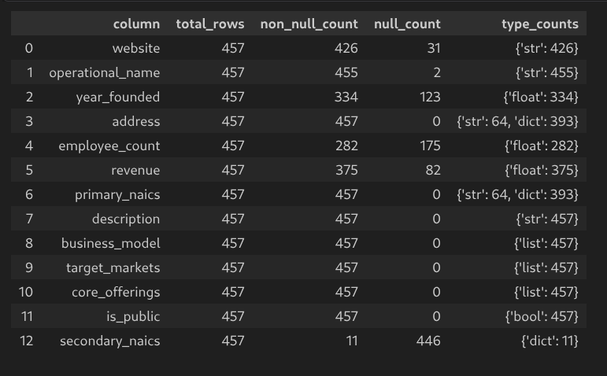 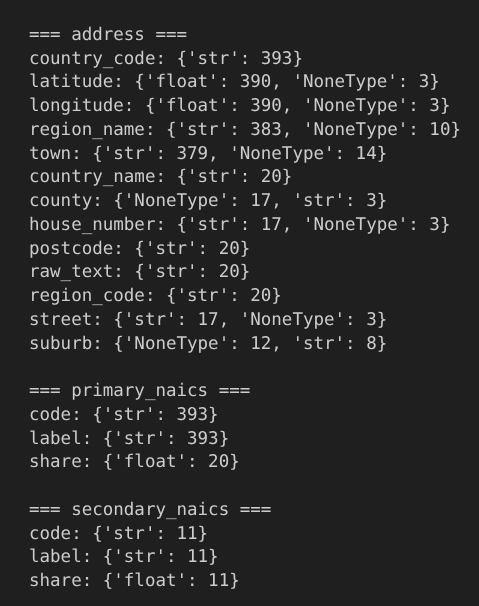

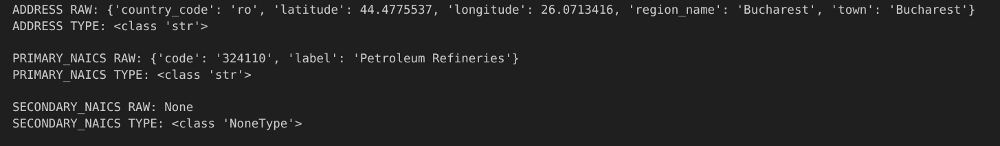 

---
I removed exact duplicate rows and parsed fields that were sometimes stored as stringified dictionaries or lists, such as `address`, `primary_naics`, `secondary_naics`, `business_model`, `target_markets`, and `core_offerings`.

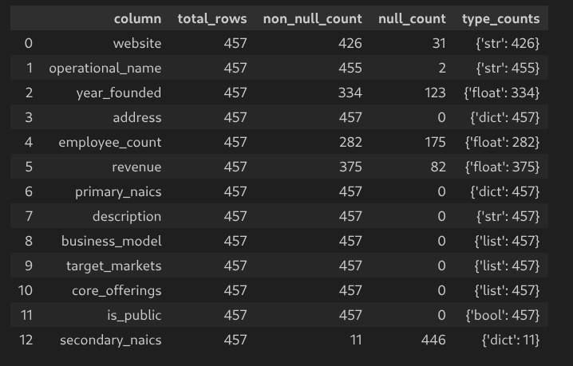 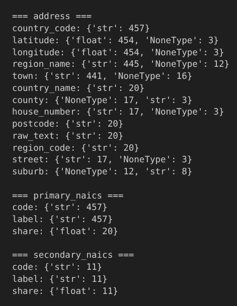

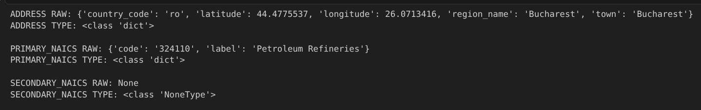 

The main output of preprocessing is `company_text`: one searchable text document for each company.

This field includes the company name, website, address text, NAICS information, description, business model, target markets, and core offerings.

I intentionally did not include `employee_count`, `revenue`, `year_founded`, or `is_public` in `company_text`, because these fields are better used later as structured filters.

After building `company_text`, I created the offline retrieval artifacts:

```text
artifacts/companies_processed.pkl
artifacts/bm25_tokens.pkl
artifacts/bm25_index.pkl
artifacts/company_embeddings.npy
artifacts/company_faiss.index
artifacts/metadata.pkl
```

## Example Queries

To sanity-check the pipeline, I tested it on several queries with different levels of difficulty.

I did not want to evaluate only simple keyword-style queries, because those could be handled reasonably well by a basic search engine. Instead, I wanted to include at least two different types of cases:

1. a query with explicit hard constraints;
2. a query that requires more semantic interpretation of the user's business intent.

The first query I selected was:

```text
Clean energy startups founded after 2018 with fewer than 200 employees
```

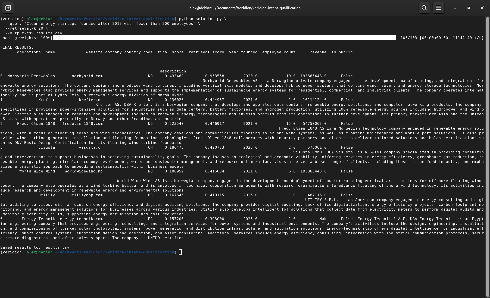

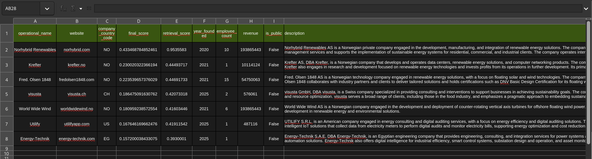

---
The second query I selected was:

```text
Companies that could supply packaging materials for a direct-to-consumer cosmetics brand
```

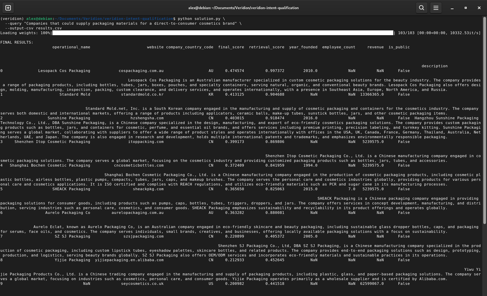

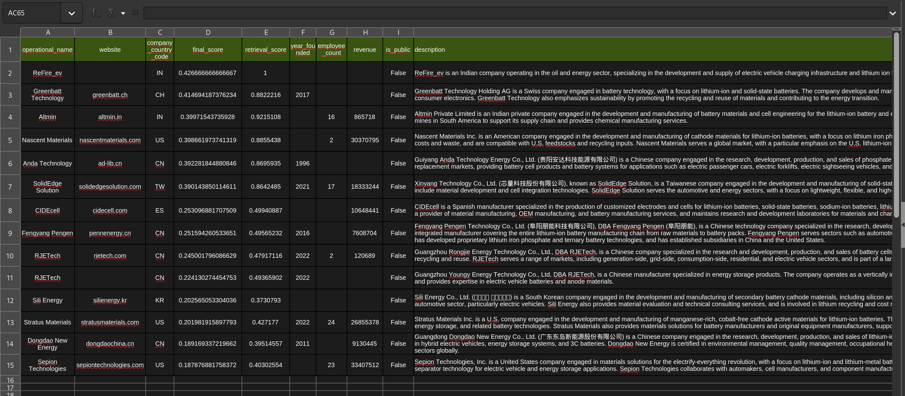

For each example, I inspected the parsed query plan, the retrieved candidates, the hard filtering behavior, and the final ranked results. The goal was not to claim that the heuristic scoring is perfect, but to check whether the pipeline behaves in a reasonable and explainable way.

## Tradeoffs

The biggest decision was not to use the LLM for every company. This would probably give better answers in some difficult cases, because the model could look at each company and reason about it directly. But I think it would make the solution too expensive and too slow for this problem. It would also make the runtime depend on how many companies I send to the LLM. So I preferred to use the LLM only once, on the query. After that, the rest of the pipeline uses cheaper methods.

This means that I optimized more for:

- low and predictable cost;
- reasonable latency;
- scalability;
- results that I can debug;
- a solution that is simple enough to explain.

Another tradeoff is the final ranking. I did not train a ranking model, because I did not have labeled examples of good and bad matches. Instead, I used a heuristic score based on the signals I already had: retrieval score, industry match, business model match, offering match, target market match, and exclusion terms.

This is not as strong as a trained reranker, but it is transparent. If a company is ranked too high or too low, I can inspect which part of the score caused that.

I also made the hard filters strict. For example, if the query asks for public companies, private companies are removed. If the query asks for companies with more than 1,000 employees, companies below that threshold are removed.

This improves precision, but it can also remove relevant companies when the data is incomplete or missing. I accepted this tradeoff because explicit constraints from the user should usually be respected.

The last important tradeoff is using both BM25 and semantic search. This makes the retrieval step a bit more complex than using only one method, but I think it is worth it. BM25 is useful when the query contains exact terms that matter. Semantic search is useful when the same idea is expressed with different words.

## Scaling

The current version is designed around an offline indexing step and a lightweight query-time pipeline.

If the system needed to handle 100,000 companies per query instead of 500, I would keep the same high-level architecture, but I would make the retrieval and filtering components more production-oriented.

The most important point is that the expensive work should remain offline:

- cleaning and parsing company records;
- building `company_text`;
- tokenizing the corpus;
- computing company embeddings;
- building the BM25 and FAISS indexes.

At query time, the system should only:

1. parse the query once with the LLM;
2. run BM25 retrieval;
3. run FAISS semantic retrieval;
4. merge a limited number of candidates;
5. apply hard filters and ranking only on that candidate set.

This means the system should not score all 100,000 companies in detail. It should retrieve a top-K candidate set first, for example a few hundred or a few thousand companies, and then apply the more expensive ranking logic only to that smaller set.

For FAISS, scaling to 100,000 companies is straightforward. Exact search may still be acceptable at this size, but for larger datasets I would use an approximate index such as IVF or HNSW.

For BM25, I would avoid rebuilding the index at runtime and keep the index precomputed. If the dataset becomes much larger or needs frequent updates, I would consider moving lexical retrieval to a search engine such as Elasticsearch, OpenSearch, or Vespa.

I would also add caching. Many users may ask similar queries, and the LLM parsing step is the most expensive online component. Caching parsed query plans and maybe retrieval results would reduce both latency and cost.

The main architectural idea would stay the same: use the LLM once to understand the query, then use scalable retrieval and deterministic ranking components for the company database.

## Error Analysis

One behavior I noticed during testing is that changing `--retrieval-k` can change not only the number of final results, but also the relative order of companies that appear in both runs.

For example, if I run the same query with a smaller `--retrieval-k`, I may get companies A, B, and C in one order. If I run the same query again with a larger `--retrieval-k`, companies A, B, and C may still appear, but their order can change.

This happens because the retrieval scores are normalized inside the candidate pool produced for that specific run. When `--retrieval-k` changes, the candidate pool changes. This also changes the minimum and maximum BM25 and semantic scores used for normalization. As a result, even a company that appears in both runs can receive a different normalized retrieval score. Since `retrieval_score` is part of the final score, the final ranking of the same companies can also change.

This is an important limitation of the current implementation. Ideally, if two companies appear in both candidate sets, their relative order should be stable unless new evidence changes the scoring. In my current implementation, part of the score depends on the composition of the candidate pool, so the ranking is sensitive to `--retrieval-k`.

This does not mean that the whole pipeline is wrong, but it means that the score fusion method is not fully stable. The system is currently using local min-max normalization, which is simple, but can make scores depend on the retrieved set.

A better version would use a more stable fusion method. For example, I could use rank-based fusion such as Reciprocal Rank Fusion, or calibrate BM25 and semantic scores independently instead of normalizing them only within the current candidate pool.

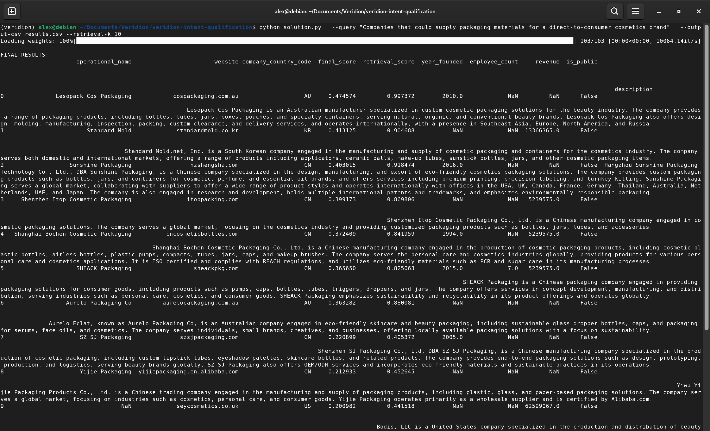
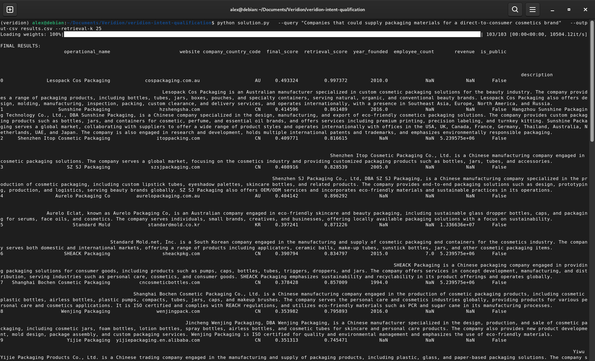

Looking at the two screenshots, the first result remains stable: `Lesopack Cos Packaging` is ranked first for both `--retrieval-k=10` and `--retrieval-k=25`.

However, several companies that appear in both runs change their relative order. For example, `Standard Mold` is ranked 2nd with `k=10`, but drops to 6th with `k=25`. `Sunshine Packaging` moves from 3rd to 2nd, and `Shenzhen Itop Cosmetic Packaging` moves from 4th to 3rd. A more visible change is `SZ SJ Packaging`, which moves from 8th to 4th, while `Aurelo Packaging Co` moves from 7th to 5th. At the same time, `Shanghai Bochen Cosmetic Packaging` drops from 5th to 8th.

So the problem is not only that a larger `retrieval-k` returns more candidates. The important observation is that the same companies can remain in the result set, but their order can still change.

## Failure Modes

There are several cases where this system can produce confident but incorrect results.

The first failure mode is incorrect query parsing. Since the LLM is used at the beginning of the pipeline, a wrong `QueryPlan` can affect all later stages. For example, if the LLM extracts the wrong industry terms, forgets an exclusion term, or turns a vague preference into a hard filter, the rest of the pipeline will follow that incorrect interpretation.

The second failure mode is retrieval recall. If BM25 and semantic search do not retrieve a relevant company in the initial candidate set, the later filtering and ranking stages cannot recover it. This is especially important when `--retrieval-k` is too small.

The third failure mode comes from strict hard filters. If the user asks for public companies or companies above a certain employee count, the system removes candidates that do not satisfy those constraints. This is correct when the data is complete, but it can remove good companies when the relevant field is missing or incorrect in the database.

Another failure mode is semantic confusion. A company can be semantically close to the query without playing the right business role. For example, a cosmetics company may be close to a query about packaging suppliers for cosmetics brands, but it is not necessarily a packaging supplier. The scoring step tries to reduce this problem, but it does not eliminate it completely.

The heuristic ranking can also fail. The final score is based on manually chosen weights, so there will be cases where the system gives too much importance to one signal and not enough to another. Without labeled training data, these weights are reasonable assumptions, not optimized parameters.

Finally, the ranking can be sensitive to the retrieval pool size. During testing, I noticed that changing `--retrieval-k` can change both the number of final companies and the order of companies that already appeared before. This happens because retrieval scores are normalized within the current candidate set. A more stable score fusion method would reduce this issue.

## What I Would Monitor

In production, I would monitor several things.

First, I would monitor the parsed `QueryPlan`, especially hard filters. If the LLM often extracts wrong filters, the system can fail before retrieval even starts.

Second, I would monitor retrieval recall. If users frequently click or accept companies that were ranked very low or missing from the first candidate set, then the retrieval stage is too weak or `--retrieval-k` is too small.

Third, I would monitor how many candidates are removed by hard filters. If too many candidates are removed because of missing values, then the filtering logic may be too strict for incomplete data.

Fourth, I would monitor score distributions and ranking stability. If small changes in `--retrieval-k` or query wording cause large changes in ranking, then the scoring and score normalization need improvement.

Finally, I would collect user feedback on returned companies. This would make it possible to tune the scoring weights or eventually train a reranker.